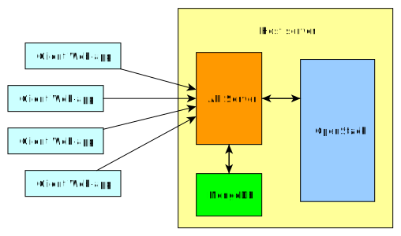

# openstack-based-spark-cluster

## Manage Spark clusters with OpenStack

### Client
Client folder contains the `Javascript` `React` web-app that is send to the client. It will allow to create, manage and destroy clusters. It requires a user to register and then to log in.

### Server
Server folder containts the `python` server that will respond to the requests of the client app. Moreover, it will communicate with the openstack instance through the `openstacksdk` APIs to apply changes. Data about users and clusters will be saved on a `MongoDB` database.

### General Schema

